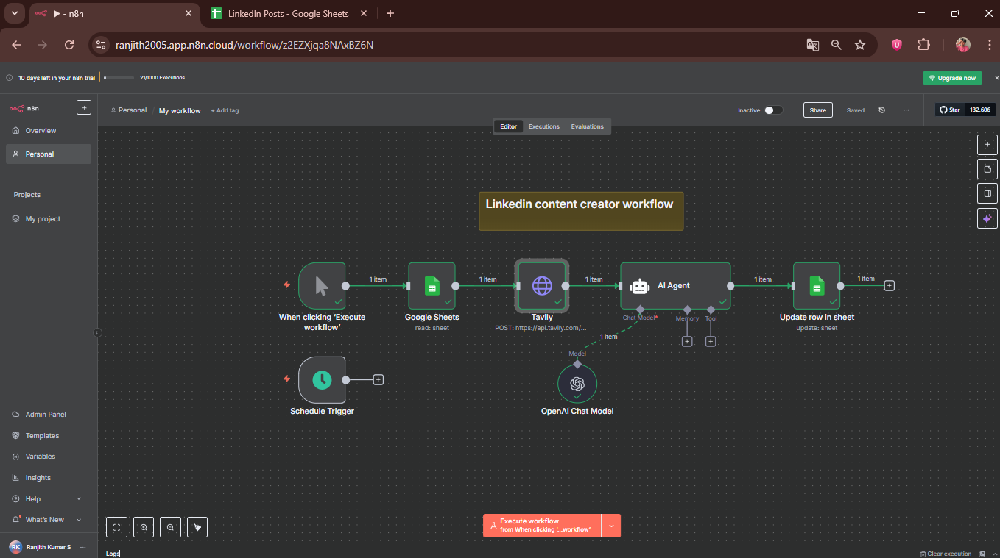
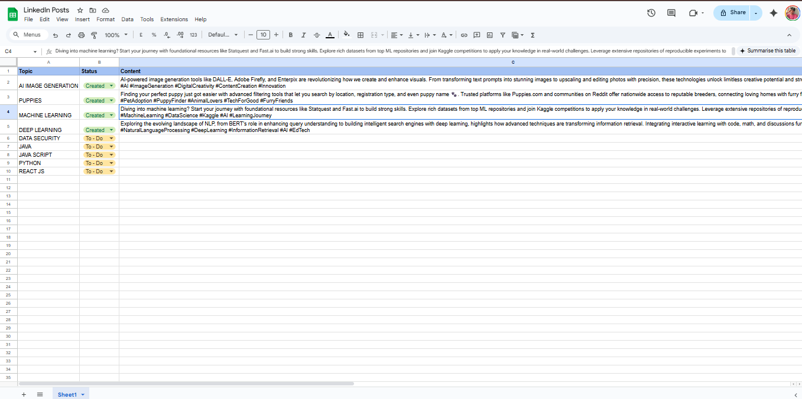
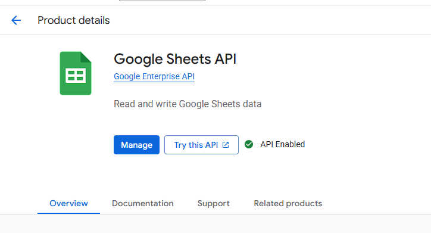
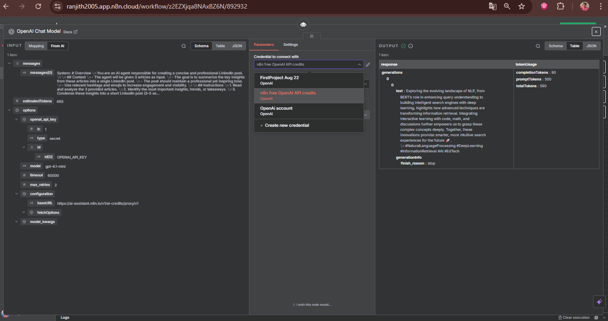

# 🚀 LinkedIn Content Creator Workflow (n8n + AI)

This project is an **AI-powered LinkedIn content automation workflow** built with **n8n**, designed to make content creation faster, smarter, and more consistent.  

## 🔹 Features
- 📄 **Google Sheets API** → Fetch and manage content ideas  
- 🌐 **Tavily API (via cURL)** → Perform real-time research  
- 🤖 **AI Agent (OpenAI Chat Model)** → Generate intelligent LinkedIn content drafts  
- 🔄 **Automation** → Update final content back into Google Sheets  

---

## 🔹 Workflow Overview

### 1️⃣ n8n Workflow

### 2️⃣ Google Sheet with Topics & Content

### 3️⃣ Google Sheets API (Enabled in Google Cloud)

### 4️⃣ OpenAI Chat Model Node in n8n

---
## 🎥 Demo Video

[Watch the demo video](https://github.com/RanjithAi/AI-AUTOMATION-PROJECTS/blob/c1658066f71fb4a5041395ea9ecbd35693d4d049/PROJECT%205/IMG/DEMO.mp4)

---

## 🔹 Tech Stack
- [n8n](https://n8n.io) (workflow automation)  
- [Google Sheets API](https://developers.google.com/sheets/api)  
- [Tavily API](https://tavily.com)  
- [OpenAI](https://platform.openai.com)  

---

## 🔹 How to Use
1. Clone this repo  
2. Import workflow JSON into **n8n**  
3. Add API keys for **Google Sheets, Tavily, and OpenAI**  
4. Run the workflow manually or schedule it  

---

### 💡 Future Improvements
- Direct posting to LinkedIn via API  
- Multi-platform support (Twitter, Medium, etc.)  
- Enhanced prompt templates for different content styles  

---

⭐ If you found this helpful, don’t forget to **star this repo**!  
